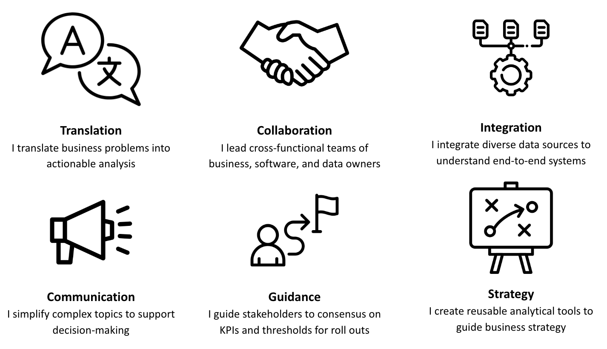
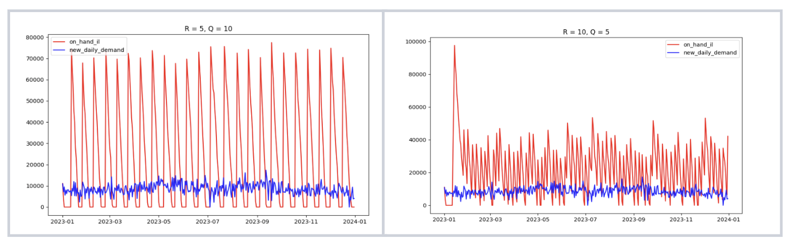
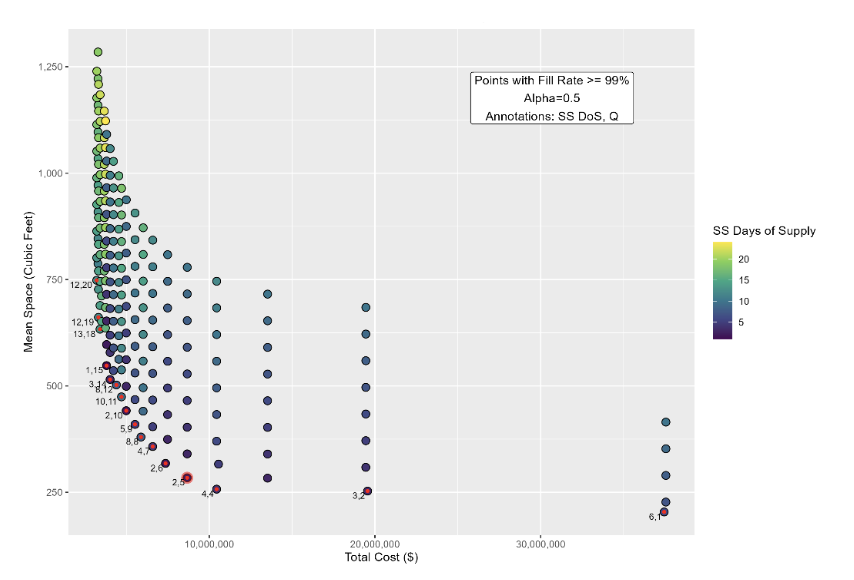
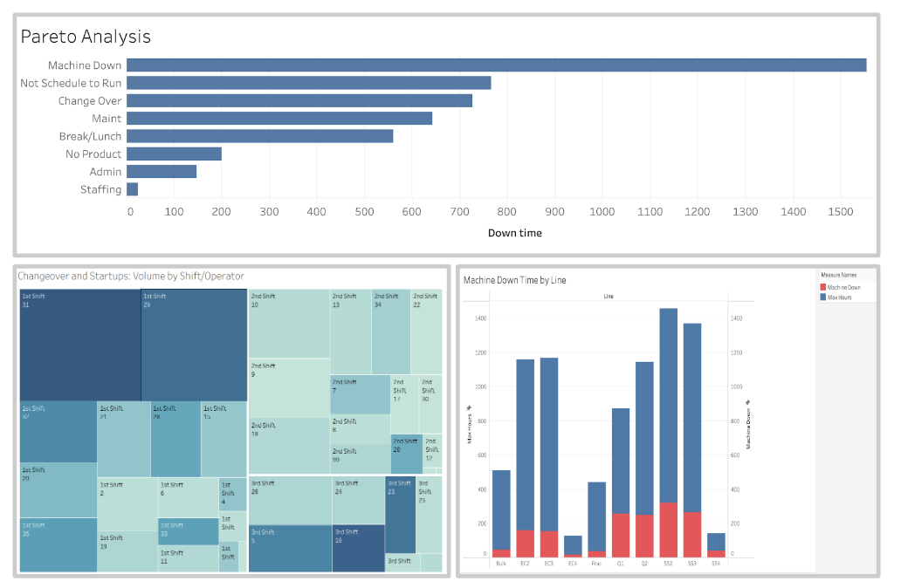

# Data Scientist | Strategy & Operations

## About Me

Colleagues consistently describe me as “technically tenacious” for my ability to track down answers and build teams of thought partners around me. In my previous role, I earned the nickname “The Bridge” for my knack for facilitating collaboration between data science and business teams, especially during the early proof-of-concept stages.

I thrive in ambiguity, and love the opportunity it gives me to create clarity from uncertainty. My ability to combine both strategic, systems thinking and tactical, hands-on problem solving make me a versatile 'utility player' in any organization.

Connect with me on [LinkedIn](https://www.linkedin.com/in/cecilia-o-donnell/)

## Sample Projects

_Note: Visualizations created with Tableau. Data taken from publicly available sources._

## Validating Clinical Data for Quality Measures using AI
This project builds on an early prototype originally created in Hex and Google Sheets. I joined the effort to extend the system’s capabilities, deepen the clinical logic, and design a scalable production-ready architecture. My focus was on clarifying CCS-specific compliance logic, identifying edge cases in HIE data, writing SQL for structured extraction, and proposing a GCP-native deployment strategy. The work represents a collaborative step toward automating clinical quality measurement using LLMs.

Read more [here](https://cc-odonnell.github.io/clinical-ai/)

## Improving Medical Care: Optimizing Network Design

When the Ebola virus swept through West Africa from April 2014 to March 2015, the urgency to effectively treat patients was paramount. Understanding where to place medical centers for rapid treatment became a critical task for NGOs and government agencies. By applying a strategic supply chain approach—similar to locating stores for customers or positioning manufacturing plants near warehouses—we can significantly improve healthcare outcomes. To optimize the placement of medical centers, I used a linear programming model. My goal was to minimize the travel distance between patients and medical centers. 

**Key Takeaways:**
This model revealed that strategically redistributing existing resources could dramatically cut travel distances for patients by over 1,000 people-miles. In Sierra Leone, targeting outlying areas like Kono and Jui could capture an additional 53% of cases.

Sample linear programming code here: [Supply Chain Network Design](https://github.com/cc-odonnell/misc/blob/main/medical_center_locations.R)

## A Comparative Approach to Inventory Optimization

In traditional inventory management, determining reorder points and quantities (R and Q) often relies on textbook formulas that assume a single ordering period. But real-world supply chains, with their dynamic demand patterns and varying lead times, need a more flexible framework. My goal was to create just that—a versatile approach for setting R and Q values in complex situations, including both single and multi-echelon network designs.

**Key Takeaways**
This project highlights the value of combining simulation and optimization in inventory management. Each method has its place: cut-off thresholds are fast and simple, LP is effective for direct optimization when priorities are clear, and Pareto analysis shines when navigating complex trade-offs. By leveraging these tools, companies can build more responsive and efficient inventory policies that adapt to the realities of continuous ordering and dynamic supply chains.

Sample python code here: [Inventory Modeling](https://github.com/cc-odonnell/im_model)

## The Future of High-Cap Investments: The Challenges of Forecasting

Using census data, I undertook the task of predicting Target store locations by simulating a 2017 perspective and projecting forward to 2019. Despite relying on population growth data, my recommendations and actual store placements rarely aligned with high-growth areas, underscoring the complexity of accurate long-term forecasting.

**Key Takeaways:**

1. **Short-Term Focus**: Limit predictions to within two years for greater accuracy.
2. **Causal Models**: Enhance forecasts with causal prediction models.
3. **Flexible Strategies**: Help stakeholders create a step-stone plan that builds in opportunities to re-evaluate and pivot as circumstances change. In this example, using ship-from-store capabilities transforms brick-and-mortar stores into mini-warehouses, allowing them to serve a broader area beyond their immediate location. This significantly enhances the store's value within the larger network.
4. **Clear Communication**: Inform stakeholders about the inherent uncertainties of long-term forecasts and provide estimated ranges instead of point estimates.

Sample R code here:[Forecasting Store Locations](https://github.com/cc-odonnell/misc/blob/main/store_locations.R)

## Visualizing Production Downtime: Prioritization through Pareto Analysis

A Pareto analysis is a tool that helps prioritize which problems to address first by focusing on the most significant issues that will have the largest impact if resolved. It assists in allocating resources more effectively by targeting areas that will provide the greatest return on investment. A company facing low productivity rates has only 4 out of its 10 product lines operating at or near the target threshold of 60% utilization.

**Key Takeaways:**

A Pareto analysis identified machine downtime as the primary cause of overall downtime, constituting nearly 20% of observed time. Within machine downtime, scheduled maintenance was the most frequent cause, accounting for 50% of that category. The second most common downtime reason was product lines not running for the full shift, representing almost 10% of observed time. Key recommendations are to 1) minimize downtime during productive hours, and 2) rework staffing schedules to ensure product lines operate for the full 8-hour shifts to improve utilization rates.

