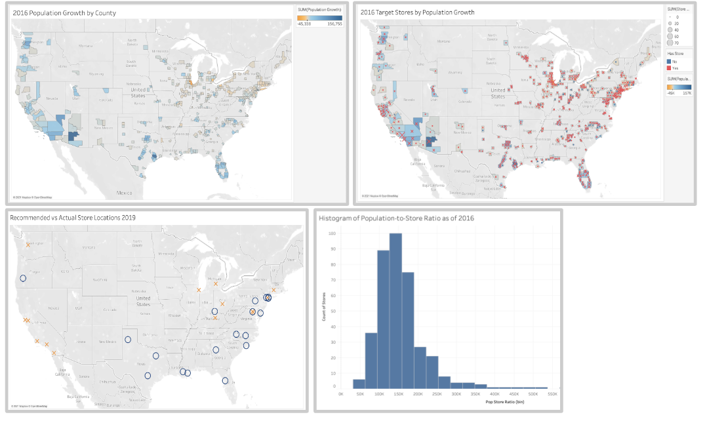
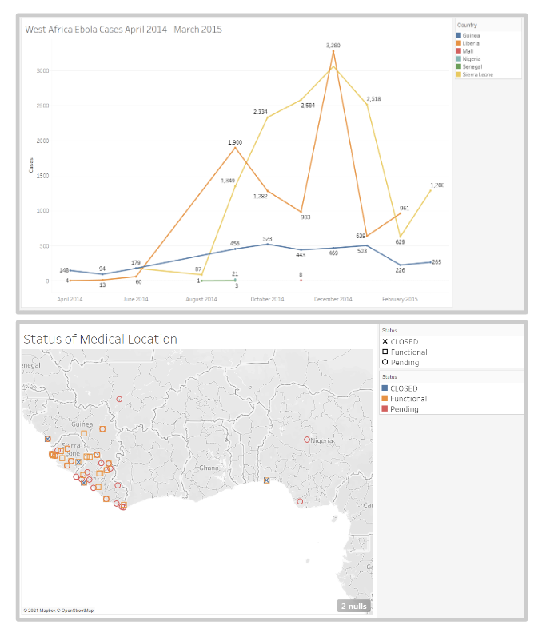

# Supply Chain Data Scientist 

# About Me

Blurb here. 

Connect with me on [LinkedIn](https://www.linkedin.com/in/cecilia-o-donnell/)

# Sample Projects

_Note: Visualizations Created with Tableau. Data taken from publicly available sources._

## Navigating the Future: The Challenges of Forecasting

Using census data, I undertook the task of predicting Target store locations by simulating a 2017 perspective and projecting forward to 2019. Despite relying on population growth data, my recommendations and actual store placements rarely aligned with high-growth areas, underscoring the complexity of accurate long-term forecasting.

**Key Takeaways:**

1. **Short-Term Focus**: Limit predictions to within two years for greater accuracy.
2. **Causal Models**: Enhance forecasts with causal prediction models.
3. **Flexible Strategies**: Help stakeholders create a step-stone plan that builds in opportunities to re-evaluate and pivot as circumstances change. In this example, using ship-from-store capabilities transforms brick-and-mortar stores into mini-warehouses, allowing them to serve a broader area beyond their immediate location. This significantly enhances the store's value within the larger network.
4. **Clear Communication**: Inform stakeholders about the inherent uncertainties of long-term forecasts and provide estimated ranges instead of point estimates.

Sample R code here:[Forecasting Store Locations](https://github.com/cc-odonnell/misc/blob/main/store_locations.R)

## Improving Medical Care: Optimizing Network Design

When the Ebola virus swept through West Africa from April 2014 to March 2015, the urgency to effectively treat patients was paramount. Understanding where to place medical centers for rapid treatment became a critical task for NGOs and government agencies. By applying a strategic supply chain approach—similar to locating stores for customers or positioning manufacturing plants near warehouses—we can significantly improve healthcare outcomes.

To optimize the placement of medical centers, I used a linear programming model. My goal was to minimize the travel distance between patients and medical centers. This model revealed that strategically redistributing existing resources could dramatically cut travel distances for patients by over 1,000 people-miles. In Sierra Leone, targeting outlying areas like Kono and Jui could capture an additional 53% of cases.

Sample linear programming code here: [Supply Chain Network Design](https://github.com/cc-odonnell/misc/blob/main/medical_center_locations.R)

